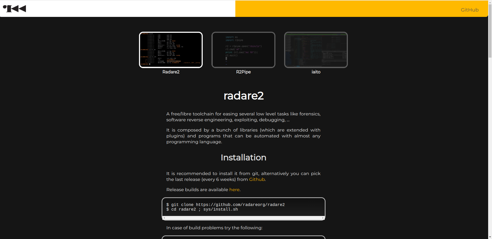
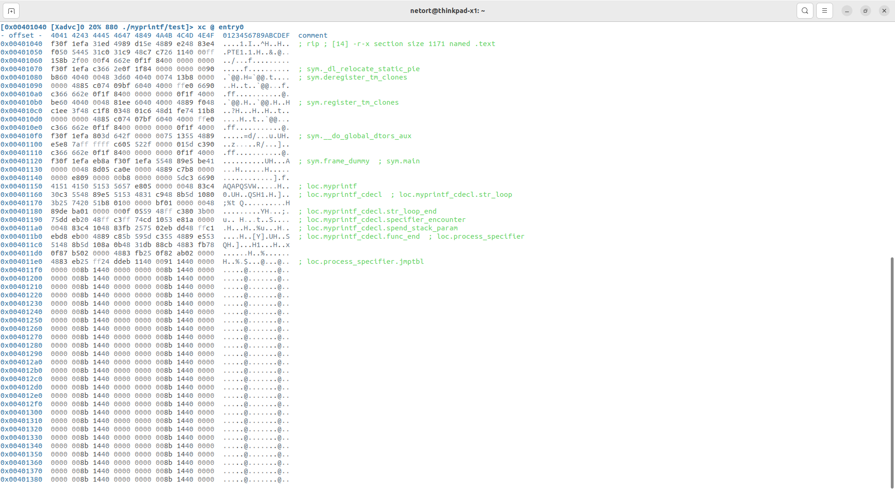
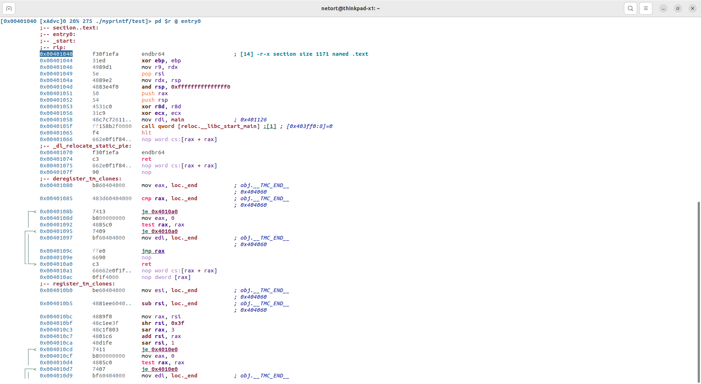
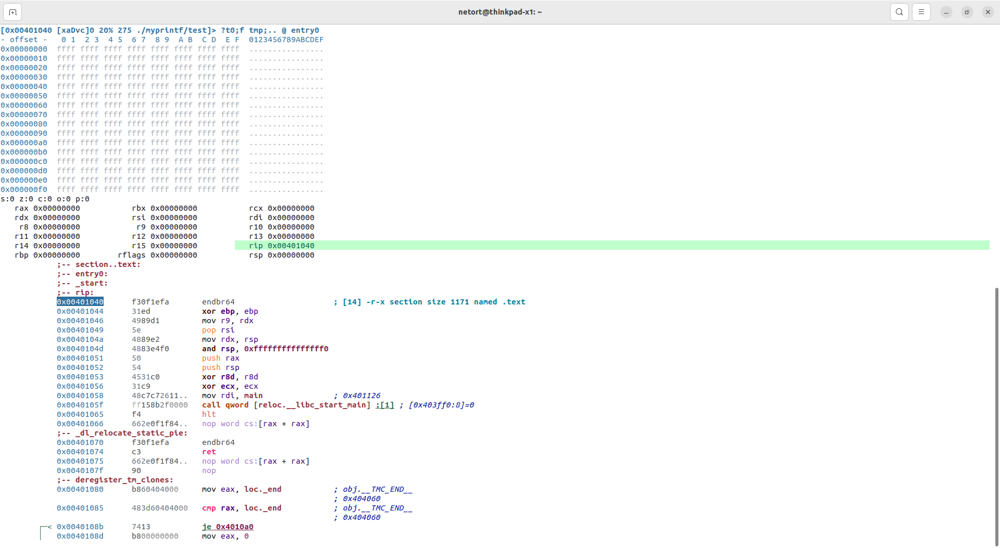
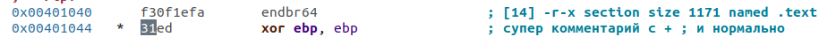
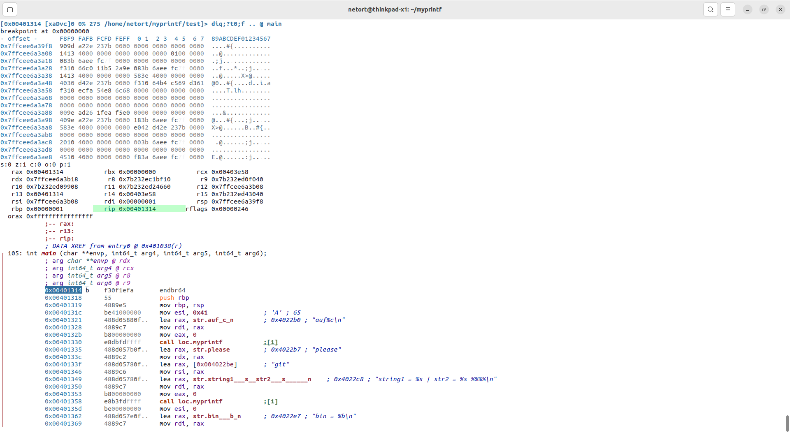
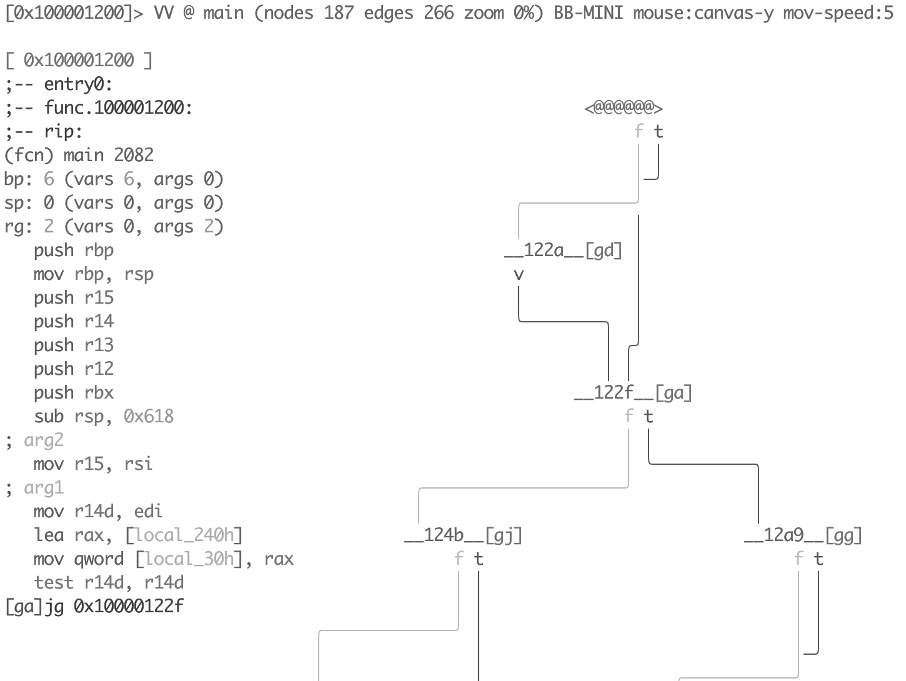
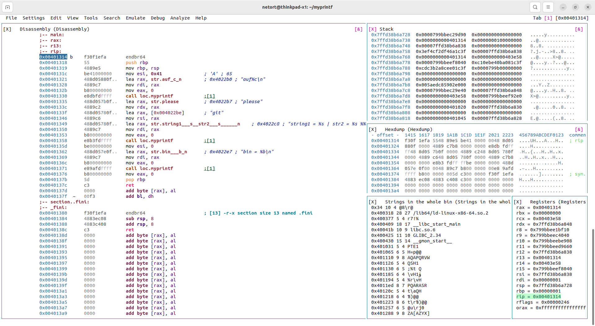

## **Быстрый вкат в radare2**
----
Если вы здесь, значит вы хардкорный линуксоид и дед не смог переманить вас на винду ради IDA. Ну или вы просто крутой чел.
В любом случае r2 не супер сложный ~~хахха~~.

- [**Быстрый вкат в radare2**](#быстрый-вкат-в-radare2)
- [Где брать инфу](#где-брать-инфу)
- [Как скачать](#как-скачать)
- [Дизассемблируем первый файл](#дизассемблируем-первый-файл)
  - [Что делать если код дизассемблировался неправильно](#что-делать-если-код-дизассемблировался-неправильно)
    - [Как поменять архитектуру/разрядность](#как-поменять-архитектуруразрядность)
- [База по навигации](#база-по-навигации)
- [Как патчить бинарник](#как-патчить-бинарник)
- [Как дебажить прогу](#как-дебажить-прогу)
  - [Вы знаете где точка входа (вы явно указали ее в ассемблерном файле (написали Start: или т.п.))](#вы-знаете-где-точка-входа-вы-явно-указали-ее-в-ассемблерном-файле-написали-start-или-тп)
  - [Вы не знаете где точка входа (например, она в функции main в си файле, которая расположена неизвестно где)](#вы-не-знаете-где-точка-входа-например-она-в-функции-main-в-си-файле-которая-расположена-неизвестно-где)
- [Как дебажить??](#как-дебажить)
- [*Visual Panels Mode*](#visual-panels-mode)
- [Полезные фичи](#полезные-фичи)
  - [Analиз списка функций](#analиз-списка-функций)
  - [Псевдокод](#псевдокод)
- [Кастомизация](#кастомизация)
    - [1. Менять тему](#1-менять-тему)
    - [2. Увеличить размер видимого стека](#2-увеличить-размер-видимого-стека)
    - [3. Настраивать собственные layouts для *Visual Panels Mode*.](#3-настраивать-собственные-layouts-для-visual-panels-mode)
  - [Как сохранить свои пресеты](#как-сохранить-свои-пресеты)
    - [Настройки](#настройки)
    - [Окошки в *Visual Panels Mode*](#окошки-в-visual-panels-mode)

## Где брать инфу
- [Официальные доки от создателей радара](https://book.rada.re/)

- [Гайд на ютубе, по которому я разбирался сам (англ)](https://www.youtube.com/watch?v=oW8Ey5STrPI&list=PLg_QXA4bGHpvsW-qeoi3_yhiZg8zBzNwQ)
- [GitHub radare2](https://github.com/radareorg/radare2)

## Как скачать
> Склонировать их репозиторий.


1. https://rada.re/n/radare2.html
2. тык radare 2
3. короче следуйте инструкциям, все понятно написано

Вставляйте команды по одной и не забудьте про
```sys/install.sh``` - это отдельная команда, а не комментарий. В bash `;` разделяет команды которые должны выполняться последовательно.

---

Чтобы проверить, что все ок:
```
netort@thinkpad-x1:~$ r2
Usage: r2 [-ACdfjLMnNqStuvwzX] [-P patch] [-p prj] [-a arch] [-b bits] [-c cmd]
          [-s addr] [-B baddr] [-m maddr] [-i script] [-e k=v] file|pid|-|--|=

```
## Дизассемблируем первый файл

```
netort@thinkpad-x1:~$ r2 <путь_до_исполняемого_файла>
WARN: Relocs has not been applied. Please use `-e bin.relocs.apply=true` or `-e bin.cache=true` next time
 -- rip and tear until it compiles
[0x00401040]>
```
- WARN - я всегда его игнорил. вроде ничего критического
- все что после ```--``` - шутка (тут они смешные кста)
- ```[0x00401040]>``` - так вы будете общаться с r2 в момент входа

Вписываем
```[0x00401040]> V``` - (регистр важен!) - и у нас открывается hexdump view



Нажимая на ```p``` мы можем переключаться между видами нашей проги в таком порядке:
**hexdump** -> **disassemble** -> **debug** -> entropy -> strings -> и так по кругу...

Жирным выделено то, чем вы реально будете пользоваться.

### Что делать если код дизассемблировался неправильно

Если вы уверены что файл открылся на нужном месте, но дизассемблер выдал не те инструкции которые вы ожидали, то скорее всего у вас неправильно указана архитектура или разрядность.

#### Как поменять архитектуру/разрядность
- ```:``` -  открыть консоль
- ```e asm.arch=?``` - посмотреть список доступных архитектур
- ```e asm.arch=x86``` - выбрать нужную архитектуру
- ```e asm.bits = 16``` - выбрать разрядность (```16``` для прог из доса)

## База по навигации

Азы перемещения по этим окошкам.

Навигация как в vim:
стрелочками тоже можно, но я бы рекомендовал заботать уже 'h', 'j', 'k', 'l' - это в миллион раз удобнее.

*Курсор:*
```c``` - чтобы двигаться по отдельным байтам вашей проги. Это может быть полезно, когда вам надо будет пропатчить бинарник.

*Комментарии*:
```;``` - в режиме курсора так вы можете оставлять комментарии к отдельным байтам или целым строчкам.



## Как патчить бинарник

> Чтобы пропатчить файл, его нужно открыть в режиме редактирования:
```r2 -w <path>```
 **НЕ ЗАБУДЬТЕ СДЕЛАТЬ РЕЗЕРВНУЮ КОПИЮ ФАЙЛА**

- режим курсора ```c```
- ```hjkl``` - подкрадываетесь к нужному байту
-  ```i``` - insert
- меняете байт, победа!

## Как дебажить прогу
> Чтобы поймать баг, открываем файл в дебаг режиме: ```r2 -d <path>```

### Вы знаете где точка входа (вы явно указали ее в ассемблерном файле (написали Start: или т.п.))
В этом случае вас загрузит прямо в ней.
### Вы не знаете где точка входа (например, она в функции main в си файле, которая расположена неизвестно где)

~~Нас загрузило в какую-то залупу.~~
Мы хотим выполнить код до момента входа в часть, написанную нами.
Командой ```db``` можно поставить точку останова по конкретному адресу или имени функции. Чаще всего вы будете ставить ее на функцию ```main```. Чуть реже на какие-то внутренние функции вашей проги: ```loc.write_hex.bahnut_piva```. По адресу вы вряд ли будете dbшиться, если вы уже вылезли из ```DOS```, но если еще нет, придется пару раз ручками набрать адрес.

Команда ```db <address_or_funcname>``` - поставить точку останова. (```db main``` в нашем случае).

Finally, команда ```dc``` - выполнять код до точки останова.

```
[0x7b232ed29290]> dc
INFO: hit breakpoint at: 0x401314
```
Ура, мы добрались до места с которого начинается наш код.

## Как дебажить??
Теперь можно перейти в визуальный режим: ```V``` и переключиться на debug view ```p```x2
> В визуальном режиме (```V```) у вас не будет консоли, но к ней можно получить доступ, нажав ```:```: все команды дальше вы будете вводить через эту кнопку.


- ```F7``` и ```F8``` - step into и step out - как в turbo debugger DosBox, удобно!
- Если вы пропустили нужное место, вы можете быстро перезагрузить дебаггер прямо из радара: ```ood```. В этом случае вас загрузит по стандартному адресу и вам придется заново выставлять точку останова на ```main``` и после этого ```dc``` на нее.
 *(вообще инфа по точкам останова сохраняется и ```db``` заново писать не обязательно, можно сразу ```dc```, если вы не путаетесь)*

## *Visual Panels Mode*

Эта штука настолько кайфовая, что я буду писать ее курсивом, типа ебать итальянец.

В консоли ```v```.

*Visual Panels Mode* ```v``` в разы удобнее, чем просто Visual Mode ```V```.

Весь прикол этой штуки в том, что ее можно настраивать под себя, поэтому идем в раздел кастомизации (он ниже).

>*IDA сосать всего лишь после 1 ложки старого советского...* [[читать в источнике...](https://www.youtube.com/watch?v=KM_rltzLWm4&list=LL&index=28)]
## Полезные фичи

### Analиз списка функций

Анализ списка функций рекомендую выполнять всегда, т к это требуется во многих других функциях r2, например он позволит строить control flow graph вашей программы.

Пишем ```aaa``` - эта команда выполнит полный анализ бинарника.

```
[0x7b232ed29290]> aaa
INFO: Analyze all flags starting with sym. and entry0 (aa)
INFO: Analyze imports (af@@@i)
INFO: Analyze entrypoint (af@ entry0)
INFO: Analyze symbols (af@@@s)
INFO: Recovering variables
INFO: Analyze all functions arguments/locals (afva@@@F)
INFO: Analyze function calls (aac)
INFO: Analyze len bytes of instructions for references (aar)
INFO: Finding and parsing C++ vtables (avrr)
INFO: Analyzing methods
INFO: Recovering local variables (afva)
INFO: Skipping type matching analysis in debugger mode (aaft)
INFO: Propagate noreturn information (aanr)
INFO: Use -AA or aaaa to perform additional experimental analysis
```

Потом ```afl``` - *analyze function list* - так радар распознает ваши функции.
```
[0x7b232ed29290]> afl
0x00401020    1     37 entry0
0x00401060    4     31 sym.deregister_tm_clones
0x00401090    4     49 sym.register_tm_clones
0x004010d0    3     32 sym.__do_global_dtors_aux
0x00401100    1      6 sym.frame_dummy
0x00401380    1     13 sym._fini
0x00401050    1      5 sym._dl_relocate_static_pie
0x00401314    1    105 main
0x00401110    1     18 loc.myprintf
0x00401122    9     86 loc.myprintf_cdecl
0x00401000    3     27 sym._init
```

Зачем это надо? На моих скриншотах слева от адресов в коде есть стрелочки, что куда джампается. Не сказал бы, что это мега полезно, но красиво выглядит и профессионально (~~IDA сосатб~~).

А еще вы можете войти в режим ```VV``` - minimap mode, в нем клавишей ```p```, мы переключаемся между профессиональными прогерскими окошками с графами и диаграммами, ~~которыми вы вряд ли будете пользоваться~~, и охуеваем как много функций и как они красиво отрисованы в консоли.


### Псевдокод
```e asm.pseudo = true ```
Вряд ли вы будете этим пользоваться, с помощью этой штуки вы можете сделать код более понятным ~~на самом деле нет~~.
`lea rax, str.love` -> `rax = rip + str.love`

`mov dword [rbp - 4], eax` ->  `dword [rbp - 4] = eax`

## Кастомизация
Вы могли заметить, что мой радар и ваш внешне отличаются.
#### 1. Менять тему
-   ```v``` - переходим в *Visual Panels Mode*
- ```m``` - выбираем меню
- ```Settings```->```Colors```->```white2``` (я вам запрещаю ставить что-то кроме white2)
- кайфуем
*P.S. У вас все слетит на дефолтные настройки при перезапуске радара, поэтому [ниже я написал, как запихать это все в конфигурационный файл.](#как-сохранить-свои-пресеты)*

#### 2. Увеличить размер видимого стека
В *Debug View* вы могли заметить, что ваш стек меньше, чем мой...
- в консоли ```:``` пишете ```e stack.size=256``` ну или сколько вам надо
- хайп
*P.S. У вас все слетит на дефолтные настройки при перезапуске радара, поэтому [ниже я написал, как запихать это все в конфигурационный файл.](#как-сохранить-свои-пресеты)*

#### 3. Настраивать собственные layouts для *Visual Panels Mode*.
> сравните то дефолтное убожество, которое там сейчас и данную фотокарточку:

-   ```v``` - переходим в *Visual Panels Mode*
- ```w``` - переходим в window mode
    > не путайте с ```W```, а то эти штуки внешне похожи, но в режиме ```W``` ничего полезного нет, вы заебетесь потом все на место возвращать
- ```Tab``` - перемещаться между панельками (```hjkl``` тоже можно)
- ```Shift + |``` разделить панельку пополам вертикально и ```-``` (без шифта!) - горизонтально
- ```Ctrl + "``` - выбрать новое назначение панельки (стек, strings и т.п.)
- ```Shift + hjkl``` - менять размер выбранной панельки.

Теперь это надо сохранить, чтобы не тыкац так каждый раз.
- ```m```- выбираем меню
- ```File```-> ```Save layout``` + ```Enter``` и придумываете крутейшее имя и ```Enter```
- когда в следующий раз зайдете в *Visual Panels Mode*:
    ```File```-> ```Load layout``` -> ```Saved``` и там выбираете
*P.S. Вас заебет так делать каждый раз при перезапуске радара, поэтому [ниже я написал, как запихать это все в конфигурационный файл.](#как-сохранить-свои-пресеты)*

### Как сохранить свои пресеты

#### Настройки
- проверьте есть ли у вас в домашней папке файл `./radare2rc`, если нет - создайте
- откройте этот файл и укажите опции которые радар будет грузить для вас автоматически

    мой конфиг (файл `.radare2rc`):
    ```
    e stack.size=256
    e scr.theme=white2
    e scr.layout=fav_dbg
    ```
То есть в него вы указываете настройки `e ...`, которые раньше писали через консоль `:`  при каждом запуске радара.

#### Окошки в *Visual Panels Mode*
Я уже говорил как сохранить текущий layout:
- file -> save layout -> победа

Можете загрузить мой layout: файл `fav_dbg` в репо.
Просто скачайте его и поместите в ```~/.local/share/radare2/r2panels```.

Удачи в вашем assembler journey, увидимся в оффисе Хуавея))
